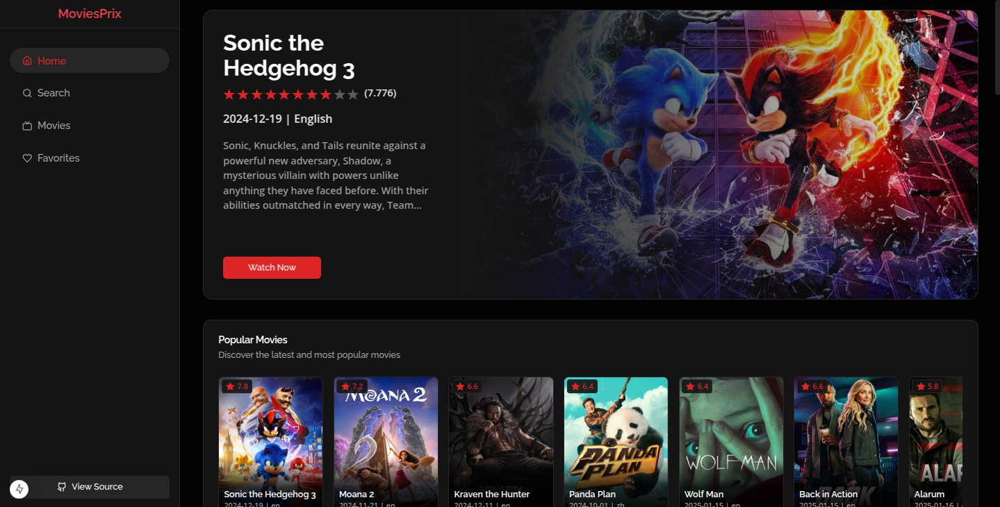

<!-- # 🎬 CinePrix - Movie Exploration Platform

[](https://moviesprix.vercel.app)
[](https://github.com/devxprite/moviesprix/stargazers)
[](https://nextjs.org/)
[](https://www.typescriptlang.org/) -->

<div align="center">
   
   <h2>CinePrix</h2>
  <!-- <a href="https://moviesprix.netlify.app/" target="_blank">➥ Live Demo</a> -->
    
</div>

<!-- ## About -->

CinePrix is a modern movie discovery web application built with Next.js 15, offering users a seamless experience to explore, search, and save their favorite movies. Integrated with the TMDB API, it provides up-to-date movie information and trends.

 

## ✨ Features

- **Movie Discovery**: Browse trending, popular, and top-rated movies
- **Movie Search**: Find movies by title
- **Detailed View**: Comprehensive movie details including cast
- **Favorites System**: User-friendly watchlist functionality
- **Responsive Design**: Perfectly adapted for all screen sizes
- **Performance Optimized**: Fast loading with Next.js server-side rendering

## 🛠 Technologies Used

- **Framework**: Next.js 15 (App Router)
- **Language**: TypeScript 5
- **Styling**: Tailwind CSS + Shadcn
- **API Integration**: TMDB Movie Database
- **Deployment**: Vercel

## 🚀 Quick Start

1. **Clone the repository**
   ```bash
   git clone https://github.com/devxprite/moviesprix.git
   cd moviesprix
   ```

2. **Install dependencies**
   ```bash
   npm install
   # or
   yarn install
   # or
   pnpm install
   ```

3. **Configure Environment Variables**
   Create `.env.local` file:
   ```env
   TMDB_API_KEY=your_tmdb_api_key_here
   ```

4. **Run development server**
   ```bash
   npm run dev
   # or
   yarn dev
   # or
   pnpm dev
   ```

## 🔧 Configuration

1. Obtain TMDB API key from [TMDB Website](https://www.themoviedb.org/settings/api)
2. Replace `your_tmdb_api_key_here` with your actual API key in `.env.local`

## 🌐 Deployment

The application is automatically deployed on Vercel:
[https://moviesprix.vercel.app](https://moviesprix.vercel.app)

[](https://vercel.com/new)

## 🤝 Contributing

Contributions are welcome! Please follow these steps:
1. Fork the repository
2. Create your feature branch (`git checkout -b feature/amazing-feature`)
3. Commit your changes (`git commit -m 'Add some amazing feature'`)
4. Push to the branch (`git push origin feature/amazing-feature`)
5. Open a Pull Request

## 🙏 Acknowledgments

- Movie data provided by [The Movie Database (TMDB)](https://www.themoviedb.org/)

---

⭐ Star this repository if you found it useful!
